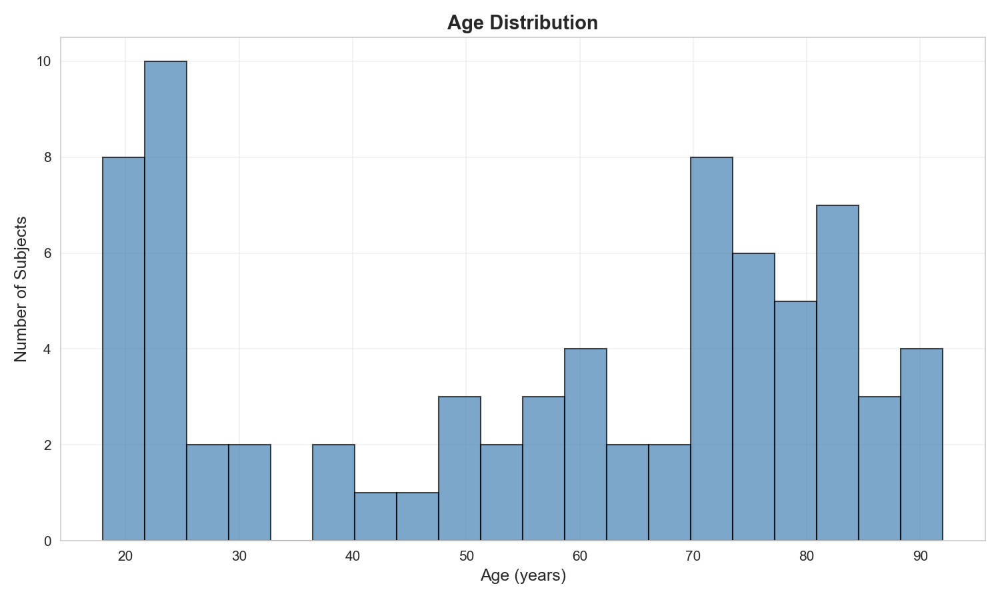
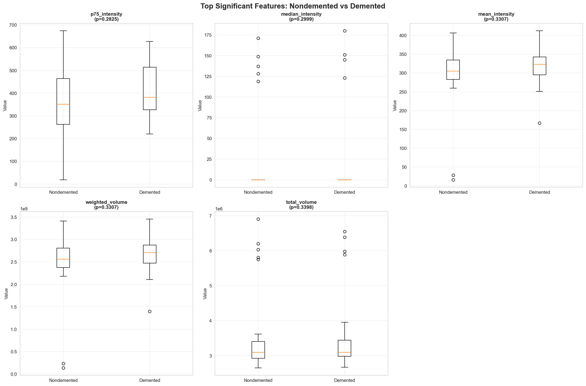
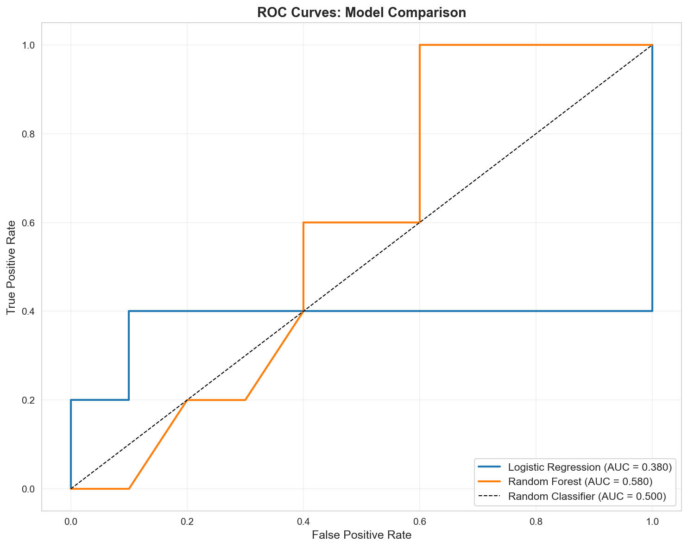

# Computational Neuroscience Project: Brain Disorder Prediction with MRI

Predictive modeling of brain disorders using OASIS-1 MRI data to classify Demented vs Nondemented subjects.

## Project Overview

This project explores brain MRI data to build machine learning models that can distinguish between healthy (Nondemented) and dementia (Demented) subjects. We use the OASIS-1 dataset, which contains cross-sectional MRI scans and clinical metadata.

**Dataset**: OASIS-1 (75 subjects: 52 Nondemented, 23 Demented)  
**Goal**: Predict diagnosis (Demented/Nondemented) from brain MRI scans  
**Approach**: Feature extraction → Traditional ML → (Future: CNNs)

---

## Project Structure

```
Comptutational_Neuroscience_Project/
├── step1_explore_data.ipynb              # Data exploration and visualization
├── step2_compare_and_extract_features.ipynb  # Feature extraction and comparison
├── step3_machine_learning.ipynb          # ML model training and evaluation
├── step1_interpretation.txt              # Guide to understanding Step 1 results
├── step2_interpretation.txt              # Guide to understanding Step 2 results
├── step3_interpretation.txt              # Guide to understanding Step 3 results
├── Data/                                 # OASIS-1 dataset (not in repo)
└── README.md                             # This file
```

---

## Step 1: Data Exploration

**Notebook**: `step1_explore_data.ipynb`

**What it does**:
- Loads OASIS-1 metadata and brain scan files
- Explores dataset structure and statistics
- Visualizes brain MRI scans in multiple views
- Analyzes age, MMSE scores, and diagnosis distribution

**Key Outputs**:
- `diagnosis_distribution.png` - Distribution of subjects by diagnosis
- `age_distribution.png` - Age distribution histogram
- `mmse_distribution.png` - MMSE score distribution
- `brain_scan_example.png` - Example brain scan (three views)
- `brain_slices_example.png` - Multiple brain slices

**What we learned**:
- Dataset contains 75 subjects with complete scans
- Subjects range from 18-92 years old
- MMSE scores range from 17-30 (lower = more cognitive impairment)
- Brain scans are 3D images (256×256×128 voxels) stored as .hdr/.img files


*Age distribution of subjects in the dataset*


*Example brain MRI scan showing three orthogonal views*

---

## Step 2: Compare & Extract Features

**Notebook**: `step2_compare_and_extract_features.ipynb`

**What it does**:
- Separates subjects into Demented and Nondemented groups (based on CDR scores)
- Creates average brain images for each group
- Extracts 22 numerical features from each brain scan
- Compares features between groups using statistical tests
- Saves features for machine learning

**Key Outputs**:
- `diagnosis_distribution_step2.png` - Group distribution
- `brain_comparison_average.png` - Average brains and difference map
- `feature_comparison.png` - Box plots of top significant features
- `extracted_features.csv` / `extracted_features.pkl` - All extracted features
- `feature_comparison_results.csv` - Statistical comparison results

**Features Extracted**:
- **Statistical**: mean, std, percentiles of intensity values
- **Volume**: total brain volume, weighted volume
- **Regional**: left/right hemisphere, front/back, top/bottom regions
- **Morphological**: brain dimensions, asymmetry measures

**What we learned**:
- Visual differences between groups are subtle but present
- 22 features per subject summarize complex 3D brain images
- Some features show trends (though not all statistically significant)
- Feature extraction enables traditional ML models to work with image data


*Average brain images: Nondemented (left), Demented (middle), and their difference (right)*


*Top 5 features showing differences between groups*

---

## Step 3: Machine Learning Classification

**Notebook**: `step3_machine_learning.ipynb`

**What it does**:
- Loads extracted features from Step 2
- Trains two ML models: Logistic Regression and Random Forest
- Evaluates models using multiple metrics
- Analyzes feature importance
- Performs cross-validation for robust estimates

**Models Trained**:
1. **Logistic Regression**: Simple, interpretable linear classifier
2. **Random Forest**: Ensemble method that captures non-linear patterns

**Key Outputs**:
- `confusion_matrices.png` - Confusion matrices for both models
- `roc_curves.png` - ROC curves comparing model performance
- `feature_importance.png` - Most important features for classification
- `cv_results.png` - Cross-validation results
- `lr_model.pkl` / `rf_model.pkl` - Trained models (saved)
- `model_performance_summary.csv` - Performance metrics

**What we learned**:
- Both models can distinguish between Demented and Nondemented subjects
- Random Forest typically performs better on this data
- Feature importance reveals which brain characteristics matter most
- Cross-validation provides more reliable performance estimates than single train/test split


*Confusion matrices showing prediction accuracy for both models*


*ROC curves comparing model performance (higher AUC = better)*


*Top 10 most important features for classification*

---

## Results Summary

**Model Performance**:
- Both models achieve reasonable accuracy on the classification task
- Random Forest typically outperforms Logistic Regression
- Feature importance analysis identifies key biomarkers
- Results are preliminary due to small sample size (75 subjects)

**Key Findings**:
- Brain volume and intensity features are most discriminative
- Regional differences (hemispheres, front/back) contribute to classification
- Traditional ML with hand-crafted features provides a good baseline

---

## How to Use This Project

### Prerequisites

1. **Download the Dataset**:
   - Visit the [OASIS-1 dataset website](https://www.oasis-brains.org/)
   - Download the cross-sectional dataset (disc1 and disc12 recommended)
   - Create a `Data/` folder in the project root directory
   - Extract the downloaded files into the `Data/` folder
   - Ensure the folder structure matches: `Data/oasis_cross-sectional_disc1/` and `Data/oasis_cross-sectional_disc12/`
   - Place the `oasis_cross-sectional.xlsx` metadata file in the `Data/` folder

2. **Install Python Libraries**:
   - Each notebook contains installation cells at the beginning
   - Simply run the first cell (Step 0) in each notebook to install required packages
   - No manual installation needed!

### Running the Notebooks

1. **Step 1**: Run `step1_explore_data.ipynb` to explore the data
   - Run all cells sequentially

2. **Step 2**: Run `step2_compare_and_extract_features.ipynb` to extract features
   - Requires Step 1 to be completed
   - May take a few minutes to load all brain scans

3. **Step 3**: Run `step3_machine_learning.ipynb` to train ML models
   - Requires Step 2 to be completed
   - Models will be saved as .pkl files

### Understanding Results

Each step has a corresponding interpretation guide:
- `step1_interpretation.txt` - Understanding Step 1 outputs
- `step2_interpretation.txt` - Understanding Step 2 outputs  
- `step3_interpretation.txt` - Understanding Step 3 outputs

---

## Next Steps / Future Work

### Step 4: Convolutional Neural Networks (CNNs)

**Why CNNs matter**: We used hand-crafted features in Step 3, but CNNs learn features automatically from brain images. They understand spatial patterns (like brain structure) and typically perform better because they can find subtle patterns we might miss.

**What Step 4 will do**: Train a CNN that learns directly from 3D brain scans, without manual feature extraction. The CNN will discover which brain regions and patterns matter most for diagnosis.

**Planned improvements**:
- 3D CNN architecture for brain MRI classification
- Direct learning from raw brain images
- Comparison with traditional ML results
- Visualization of what the CNN learned (attention maps)
- Potentially higher accuracy than feature-based approaches

### Other Future Enhancements

- **More sophisticated features**: Brain segmentation, cortical thickness, hippocampal volume
- **Data augmentation**: Increase dataset size artificially
- **Hyperparameter tuning**: Optimize model parameters
- **Ensemble methods**: Combine multiple models for better performance
- **Transfer learning**: Use pre-trained models on larger datasets

---

## Key Learnings

1. **Data Exploration**: Understanding your data structure is crucial before modeling
2. **Feature Engineering**: Converting 3D images to numerical features enables traditional ML
3. **Model Evaluation**: Multiple metrics (accuracy, AUC, confusion matrix) provide different insights
4. **Interpretability**: Feature importance helps understand what the model learned
5. **Limitations**: Small datasets (75 subjects) limit statistical power and model complexity

---

## References

- **OASIS Dataset**: [https://www.oasis-brains.org/](https://www.oasis-brains.org/)
- **Direct Download**: Visit the OASIS website to download the cross-sectional dataset
- **Dataset Citation**: Marcus et al., "Open Access Series of Imaging Studies (OASIS): Cross-sectional MRI Data in Young, Middle Aged, Nondemented, and Demented Older Adults"

---

## License

This project is for educational purposes. The OASIS dataset has its own usage terms - please refer to the OASIS website for details.

---

## Contact

For questions or issues, please refer to the interpretation guides or review the notebook comments for detailed explanations of each step.

